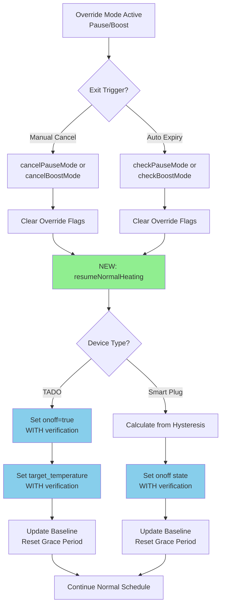

# Resume Temperature Verification Enhancement

## Flow Diagram



## Problem Analysis

When resuming heating after pause or boost mode cancellation/expiry, the system currently:
- Shows debug notifications only for `onoff=true` verification
- Does NOT set and verify the target temperature
- User expects to see temperature setting and verification as well

### Current Notification Example
```
🏠 Stue - Heating Update
⭐ 🔄 Pause cancelled • Resumed schedule

📊 🌡️22.2→22°C
⏰ Next: 22:00 → 22°C (Evening)
🐛 Stue: ✅ Verified in 48ms: onoff=true  ← Only onoff verification
🐛 Stue: ✅ Success: onoff=true
🐛 Stue: 📤 Sending onoff=true
```

### Root Cause

1. **Pause Mode Flow**:
   - `cancelPauseMode()` (line 654) - Only clears flags, doesn't resume heating
   - `checkPauseMode()` (line 677) - On expiry, clears flags and continues to normal flow
   - Normal flow eventually calls `setHeating()` but may skip temperature if already correct

2. **Boost Mode Flow**:
   - `cancelBoostMode()` (line 435) - Only clears flags
   - `checkBoostMode()` (line 472) - On expiry, clears flags
   - Same issue with normal flow

3. **setHeating() Optimization** (line 1514):
   - Only sends commands if values differ from current state
   - If TADO target temperature is already correct, it skips the command
   - This is efficient but prevents explicit verification when resuming

## Solution Design

### Overview
Add explicit resume logic that actively sets and verifies both `onoff` and `target_temperature` when resuming from override modes.

### Key Principles

1. **Explicit Resume**: Don't just clear flags and hope - actively restore heating
2. **Always Verify**: When resuming, always set temperature even if already correct
3. **Consistent Pattern**: Apply same logic to pause expiry, pause cancel, boost expiry, boost cancel
4. **Smart Plugs Too**: Even though they don't have temperature, show verification in debug

### Implementation Plan

#### 1. Create Resume Helper Function

```javascript
/**
 * Resume normal heating after override mode cancellation/expiry
 * Explicitly sets both onoff and target temperature with verification
 * @param {Object} slot - Current time slot with target temperature
 * @param {boolean} fromExpiry - True if auto-expired, false if manually cancelled
 * @param {string} modeType - 'pause' or 'boost' for logging
 * @returns {Promise<boolean>} True if resumed successfully
 */
async function resumeNormalHeating(slot, fromExpiry, modeType) {
    log(`\n--- RESUMING NORMAL HEATING (${modeType} ${fromExpiry ? 'expired' : 'cancelled'}) ---`);
    
    // Calculate correct target temperature for current schedule
    const tadoAway = await isTadoAway();
    const inactivity = await checkInactivity(slot);
    const inactivityOffset = inactivity.inactivityOffset || 0;
    
    let resumeTarget = slot.target;
    
    // Apply away mode minimum if currently away
    if (tadoAway && ROOM.settings.tadoAwayMinTemp !== null) {
        resumeTarget = ROOM.settings.tadoAwayMinTemp;
        log(`🏠 Away mode: Using minimum ${resumeTarget}°C`);
    }
    // Apply inactivity offset if room is inactive and not in away mode
    else if (!tadoAway && inactivity.inactive && inactivityOffset > 0) {
        resumeTarget -= inactivityOffset;
        log(`💤 Inactivity mode active - reducing target by ${inactivityOffset}°C`);
        log(`→ Resume target: ${resumeTarget}°C (with inactivity offset)`);
    } else {
        log(`→ Resume target: ${resumeTarget}°C (scheduled target)`);
    }
    
    if (ROOM.heating.type === 'smart_plug') {
        log(`Smart plug mode: Resuming to scheduled state`);
        
        // For smart plugs, use hysteresis to determine if heating should be on/off
        const roomTemp = await getRoomTemperature();
        if (roomTemp === null) {
            log(`❌ Cannot read room temperature - skipping resume`);
            return false;
        }
        
        const hysteresis = ROOM.heating.hysteresis || 0.5;
        const targetLow = resumeTarget - (hysteresis / 2);
        const targetHigh = resumeTarget + (hysteresis / 2);
        const shouldTurnOn = roomTemp < targetLow;
        
        log(`Room: ${roomTemp}°C, Target range: ${targetLow}-${targetHigh}°C`);
        log(`Resume state: ${shouldTurnOn ? 'ON' : 'OFF'}`);
        
        let anyVerified = false;
        for (const deviceId of ROOM.heating.devices) {
            try {
                const device = await Homey.devices.getDevice({ id: deviceId });
                const result = await sendCommandWithVerification(
                    device,
                    'onoff',
                    shouldTurnOn,
                    ROOM.zoneName,
                    SESSION_ID
                );
                
                if (result.success && result.verified) {
                    log(`🔌 ${device.name}: ${shouldTurnOn ? 'ON' : 'OFF'} (verified)`);
                    anyVerified = true;
                } else if (result.success) {
                    log(`⚠️ ${device.name}: ${shouldTurnOn ? 'ON' : 'OFF'} (not verified)`);
                } else {
                    log(`❌ ${device.name}: Failed to set state`);
                }
            } catch (error) {
                log(`❌ Error resuming ${deviceId}: ${error.message}`);
            }
        }
        
        if (anyVerified) {
            global.set(`${ROOM.zoneName}.Heating.LastAutomationChangeTime`, Date.now());
            log(`📝 Grace period reset (resume verified)`);
        }
        
        return anyVerified;
        
    } else if (ROOM.heating.type === 'tado_valve') {
        log(`TADO mode: Resuming with target ${resumeTarget}°C`);
        
        try {
            const device = await Homey.devices.getDevice({ id: ROOM.heating.devices[0] });
            let verified = false;
            
            // ALWAYS set onoff to ensure it's on
            const onoffResult = await sendCommandWithVerification(
                device,
                'onoff',
                true,
                ROOM.zoneName,
                SESSION_ID
            );
            
            if (onoffResult.success && onoffResult.verified) {
                log(`🔥 TADO turned ON (verified)`);
                verified = true;
            } else if (onoffResult.success) {
                log(`⚠️ TADO turned ON (not verified)`);
            } else {
                log(`❌ TADO turn ON failed`);
            }
            
            // ALWAYS set temperature even if already correct (for explicit verification)
            // This ensures user sees temperature verification when resuming
            const tempResult = await sendCommandWithVerification(
                device,
                'target_temperature',
                resumeTarget,
                ROOM.zoneName,
                SESSION_ID
            );
            
            if (tempResult.success && tempResult.verified) {
                log(`🎯 TADO target set to ${resumeTarget}°C (verified)`);
                verified = true;
            } else if (tempResult.success) {
                log(`⚠️ TADO target set to ${resumeTarget}°C (not verified)`);
            } else {
                log(`❌ TADO temperature change failed`);
            }
            
            // Update expected target to prevent false manual detection
            global.set(`${ROOM.zoneName}.Heating.ExpectedTargetTemp`, resumeTarget);
            
            if (verified) {
                global.set(`${ROOM.zoneName}.Heating.LastAutomationChangeTime`, Date.now());
                log(`📝 Expected target updated to ${resumeTarget}°C and grace period reset (verified)`);
            } else {
                log(`📝 Expected target updated to ${resumeTarget}°C (resume mode)`);
            }
            
            return verified;
        } catch (error) {
            log(`❌ Error resuming TADO: ${error.message}`);
            return false;
        }
    }
    
    return false;
}
```

#### 2. Update cancelPauseMode()

**Current** (line 654):
```javascript
function cancelPauseMode() {
    const wasActive = global.get(`${ROOM.zoneName}.Heating.PauseMode`);
    
    // Clear pause mode variables
    global.set(`${ROOM.zoneName}.Heating.PauseMode`, false);
    global.set(`${ROOM.zoneName}.Heating.PauseStartTime`, null);
    global.set(`${ROOM.zoneName}.Heating.PauseDuration`, null);
    
    if (wasActive) {
        log(`\n🔄 PAUSE MODE CANCELLED`);
        log(`Room: ${roomArg} (${ROOM.zoneName})`);
        log(`Resuming normal schedule operation`);
        
        addChange(`🔄 Pause cancelled`);
        addChange(`Resumed schedule`);
        return true;
    } else {
        log(`\nℹ️ No active pause to cancel`);
        log(`Room: ${roomArg} (${ROOM.zoneName})`);
        return false;
    }
}
```

**Enhanced**:
```javascript
async function cancelPauseMode(currentSlot) {
    const wasActive = global.get(`${ROOM.zoneName}.Heating.PauseMode`);
    
    // Clear pause mode variables
    global.set(`${ROOM.zoneName}.Heating.PauseMode`, false);
    global.set(`${ROOM.zoneName}.Heating.PauseStartTime`, null);
    global.set(`${ROOM.zoneName}.Heating.PauseDuration`, null);
    
    if (wasActive) {
        log(`\n🔄 PAUSE MODE CANCELLED`);
        log(`Room: ${roomArg} (${ROOM.zoneName})`);
        log(`Resuming normal schedule operation`);
        
        addChange(`🔄 Pause cancelled`);
        addChange(`Resumed schedule`);
        
        // Explicitly resume heating with temperature verification
        if (currentSlot) {
            await resumeNormalHeating(currentSlot, false, 'pause');
        }
        
        return true;
    } else {
        log(`\nℹ️ No active pause to cancel`);
        log(`Room: ${roomArg} (${ROOM.zoneName})`);
        return false;
    }
}
```

#### 3. Update cancelBoostMode()

Similar pattern - add slot parameter and call `resumeNormalHeating()`.

#### 4. Update checkPauseMode() Expiry

**Current** (line 696):
```javascript
if (minutesElapsed >= pauseDuration) {
    // Pause expired - clear it
    log(`\n⏱️ PAUSE MODE EXPIRED`);
    log(`Duration: ${pauseDuration} minutes elapsed`);
    
    global.set(`${ROOM.zoneName}.Heating.PauseMode`, false);
    global.set(`${ROOM.zoneName}.Heating.PauseStartTime`, null);
    global.set(`${ROOM.zoneName}.Heating.PauseDuration`, null);
    
    // Reset grace period to prevent false manual detection after pause expires
    global.set(`${ROOM.zoneName}.Heating.LastAutomationChangeTime`, Date.now());
    log(`📝 Grace period reset to prevent false manual detection after pause expiration`);
    
    addChange(`⏱️ Pause ended`);
    addChange(`Resumed schedule`);
    
    return { active: false, expired: true, remainingMinutes: 0 };
}
```

**Enhanced**:
Add a new return property `needsResume: true` and handle it in main execution.

#### 5. Update checkBoostMode() Expiry

Similar pattern to pause mode expiry.

#### 6. Update Main Execution Flow

**Current** (line 2527-2530):
```javascript
// If pause just expired, continue with normal schedule
if (pauseStatus.expired) {
    log(`\n⏱️ Pause mode expired - resuming normal schedule`);
}
```

**Enhanced**:
```javascript
// If pause just expired, explicitly resume heating
if (pauseStatus.expired) {
    log(`\n⏱️ Pause mode expired - resuming normal schedule`);
    
    // Get current slot for temperature target
    const currentSlot = getCurrentTimeSlot(schedule, now);
    await resumeNormalHeating(currentSlot, true, 'pause');
}
```

#### 7. Handle Manual Cancel in Main Execution

**Current** (line 2445):
```javascript
if (requestCancel) {
    const wasCancelled = cancelAllOverrideModes();
    
    if (wasCancelled) {
        // Override was active and cancelled - continue with normal schedule
        log(`Continuing to run normal schedule after cancellation...`);
    } else {
        // No active overrides - just run normally
        log(`No active overrides - running normal schedule`);
    }
}
```

**Enhanced**:
```javascript
if (requestCancel) {
    // Get current slot before canceling (needed for resume)
    const now = getDanishLocalTime();
    const weekend = isWeekend(now);
    const schoolDay = !weekend ? await isSchoolDay() : false;
    
    let baseSchedule, dayType;
    if (weekend) {
        baseSchedule = ROOM.schedules.weekend;
        dayType = 'Weekend';
    } else if (schoolDay) {
        baseSchedule = ROOM.schedules.weekday;
        dayType = 'School Day';
    } else {
        baseSchedule = ROOM.schedules.holiday;
        dayType = 'Holiday/Vacation';
    }
    
    const schedule = await getCompleteSchedule(baseSchedule);
    const currentSlot = getCurrentTimeSlot(schedule, now);
    
    const wasCancelled = await cancelAllOverrideModes(currentSlot);
    
    if (wasCancelled) {
        // Override was active and cancelled - explicitly resume
        log(`Resuming normal schedule after cancellation...`);
        await resumeNormalHeating(currentSlot, false, 'cancel');
    } else {
        // No active overrides - just run normally
        log(`No active overrides - running normal schedule`);
    }
}
```

### Testing Checklist

- [ ] Test pause mode manual cancellation - verify onoff AND temperature
- [ ] Test pause mode auto-expiry - verify onoff AND temperature  
- [ ] Test boost mode manual cancellation - verify onoff AND temperature
- [ ] Test boost mode auto-expiry - verify onoff AND temperature
- [ ] Test with TADO devices in away mode during resume
- [ ] Test with TADO devices in inactive mode during resume
- [ ] Test with smart plugs to ensure onoff verification still works
- [ ] Verify debug notifications show both capabilities
- [ ] Test manual override cancellation (if applying same pattern)
- [ ] Verify baseline storage after resume to prevent false manual detection

### Expected Notification After Enhancement

```
🏠 Stue - Heating Update
⭐ 🔄 Pause cancelled • Resumed schedule

📊 🌡️22.2→22°C
⏰ Next: 22:00 → 22°C (Evening)
🐛 Stue: ✅ Verified in 48ms: onoff=true
🐛 Stue: ✅ Success: onoff=true
🐛 Stue: 📤 Sending onoff=true
🐛 Stue: ✅ Verified in 52ms: target_temperature=22°C  ← NEW
🐛 Stue: ✅ Success: target_temperature=22°C          ← NEW
🐛 Stue: 📤 Sending target_temperature=22°C          ← NEW
```

## Additional Considerations

### 1. Force Temperature Setting

The key is to ALWAYS call `sendCommandWithVerification()` for temperature when resuming, even if the device is already at the correct target. This provides:
- Explicit verification that temperature is correct
- Debug notifications for user confidence
- Baseline update for manual detection

### 2. Boost Mode Resume

When boost expires, the temperature will be very different (25°C vs schedule target). The resume logic will:
1. Turn onoff to true (probably already true)
2. Set temperature to schedule target (needs to change from 25°C)
3. Both will be verified and logged

### 3. Order of Operations

Resume should happen:
1. AFTER override mode is cleared (flags are reset)
2. BEFORE normal schedule continues
3. This ensures clean state transition

### 4. Error Handling

If resume fails (verification timeout):
- Log warning but don't block execution
- Normal schedule flow will retry on next run
- Consider adding retry logic specific to resume

## Summary

This enhancement ensures that when resuming from pause or boost modes:
1. Both `onoff` and `target_temperature` are explicitly set
2. Both commands are verified with debug notifications
3. User sees full confirmation that heating is restored correctly
4. Baseline is updated to prevent false manual detection
5. Pattern is consistent across all override mode exit paths
