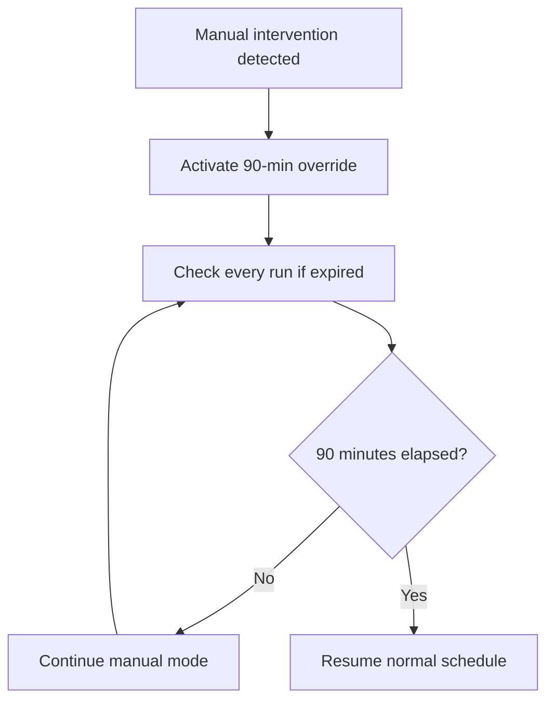
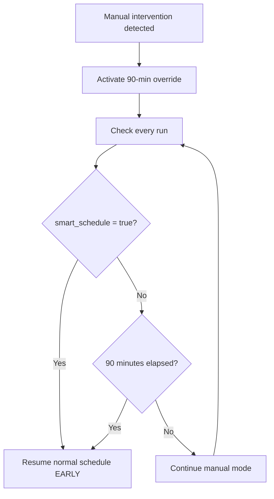

# Smart Schedule Early Exit from Manual Override Mode

## Problem Statement

When manual control is detected on a Tado device, the heating system enters a 90-minute manual override mode to respect the user's manual adjustment. However, there's a mismatch:

- **System manual override:** 90 minutes (hardcoded)
- **Device manual control:** User-configurable duration (e.g., 30, 60 minutes, or "until next auto change")

**The Issue:** When the device's manual control expires and returns to automatic mode, the system continues in manual override mode for the full 90 minutes, ignoring the fact that the device is already back in auto mode.

**The Indicator:** The `onoff.smart_schedule` property becomes `true` when the device returns to automatic schedule mode.

## Solution Overview

Monitor the `onoff.smart_schedule` property during manual override mode. If it becomes `true`, immediately exit manual override mode and resume normal schedule operation.

## Current Manual Override Flow



## Proposed Enhanced Flow



## Implementation Plan

### Step 1: Update `checkManualOverrideMode()` Function

**Location:** [`room_heating.js`](../room_heating.js) lines 1037-1074

**Current Logic:**
```javascript
function checkManualOverrideMode() {
    const overrideActive = global.get(`${ROOM.zoneName}.Heating.ManualOverrideMode`);
    
    if (!overrideActive) {
        return { active: false, expired: false, remainingMinutes: 0 };
    }
    
    const overrideStartTime = global.get(`${ROOM.zoneName}.Heating.ManualOverrideStartTime`);
    const overrideDuration = global.get(`${ROOM.zoneName}.Heating.ManualOverrideDuration`) || 90;
    
    // Check if 90 minutes elapsed
    const minutesElapsed = (Date.now() - overrideStartTime) / 1000 / 60;
    const remainingMinutes = Math.max(0, overrideDuration - minutesElapsed);
    
    if (minutesElapsed >= overrideDuration) {
        // Override expired
        // ... clear variables ...
        return { active: false, expired: true, remainingMinutes: 0 };
    }
    
    return { active: true, expired: false, remainingMinutes: Math.ceil(remainingMinutes) };
}
```

**Enhanced Logic:**
```javascript
async function checkManualOverrideMode() {
    const overrideActive = global.get(`${ROOM.zoneName}.Heating.ManualOverrideMode`);
    
    if (!overrideActive) {
        return { active: false, expired: false, remainingMinutes: 0, reason: null };
    }
    
    const overrideStartTime = global.get(`${ROOM.zoneName}.Heating.ManualOverrideStartTime`);
    const overrideDuration = global.get(`${ROOM.zoneName}.Heating.ManualOverrideDuration`) || 90;
    
    // Check if 90 minutes elapsed
    const minutesElapsed = (Date.now() - overrideStartTime) / 1000 / 60;
    const remainingMinutes = Math.max(0, overrideDuration - minutesElapsed);
    
    // NEW: Check if device has returned to auto mode (only for TADO)
    if (ROOM.heating.type === 'tado_valve') {
        try {
            const device = await Homey.devices.getDevice({ id: ROOM.heating.devices[0] });
            const smartSchedule = device.capabilitiesObj?.onoff?.smart_schedule;
            
            if (smartSchedule === true) {
                // Device has returned to automatic schedule mode
                log(`\n🔄 MANUAL OVERRIDE AUTO-CANCELLED`);
                log(`Device returned to automatic schedule (smart_schedule = true)`);
                log(`Duration: ${Math.floor(minutesElapsed)} minutes elapsed of ${overrideDuration} planned`);
                
                // Clear manual override mode variables
                global.set(`${ROOM.zoneName}.Heating.ManualOverrideMode`, false);
                global.set(`${ROOM.zoneName}.Heating.ManualOverrideStartTime`, null);
                global.set(`${ROOM.zoneName}.Heating.ManualOverrideDuration`, null);
                global.set(`${ROOM.zoneName}.Heating.ManualOverrideType`, null);
                global.set(`${ROOM.zoneName}.Heating.ManualOverrideOriginalValue`, null);
                
                addChange(`⏱️ Auto resumed`);
                addChange(`Device → schedule`);
                
                return { active: false, expired: true, remainingMinutes: 0, reason: 'smart_schedule' };
            }
        } catch (error) {
            log(`⚠️ Could not check smart_schedule property: ${error.message}`);
            // Continue with normal expiration check
        }
    }
    
    if (minutesElapsed >= overrideDuration) {
        // Override expired normally
        log(`\n⏱️ MANUAL OVERRIDE MODE EXPIRED`);
        log(`Duration: ${overrideDuration} minutes elapsed`);
        
        global.set(`${ROOM.zoneName}.Heating.ManualOverrideMode`, false);
        global.set(`${ROOM.zoneName}.Heating.ManualOverrideStartTime`, null);
        global.set(`${ROOM.zoneName}.Heating.ManualOverrideDuration`, null);
        global.set(`${ROOM.zoneName}.Heating.ManualOverrideType`, null);
        global.set(`${ROOM.zoneName}.Heating.ManualOverrideOriginalValue`, null);
        
        addChange(`⏱️ Override ended`);
        addChange(`Resumed schedule`);
        
        return { active: false, expired: true, remainingMinutes: 0, reason: 'timeout' };
    }
    
    return { active: true, expired: false, remainingMinutes: Math.ceil(remainingMinutes), reason: null };
}
```

### Step 2: Update Manual Override Handling in Main Execution

**Location:** [`room_heating.js`](../room_heating.js) lines 2788-2848

**Current Code:**
```javascript
// Check if manual override mode is active
const manualOverrideStatus = checkManualOverrideMode();

if (manualOverrideStatus.active) {
    log(`\n🤚 MANUAL OVERRIDE MODE ACTIVE`);
    log(`Remaining: ${manualOverrideStatus.remainingMinutes} minutes`);
    // ... handle manual override ...
}

// If manual override just expired, explicitly resume heating
if (manualOverrideStatus.expired) {
    log(`\n⏱️ Manual override expired - resuming normal schedule`);
    // ... resume heating ...
}
```

**Enhanced Code:**
```javascript
// Check if manual override mode is active
const manualOverrideStatus = await checkManualOverrideMode(); // NOW ASYNC

if (manualOverrideStatus.active) {
    log(`\n🤚 MANUAL OVERRIDE MODE ACTIVE`);
    log(`Remaining: ${manualOverrideStatus.remainingMinutes} minutes`);
    // ... handle manual override ...
}

// If manual override just expired, explicitly resume heating
if (manualOverrideStatus.expired) {
    if (manualOverrideStatus.reason === 'smart_schedule') {
        log(`\n🔄 Manual override cancelled by device - returning to automatic schedule`);
    } else {
        log(`\n⏱️ Manual override expired - resuming normal schedule`);
    }
    // ... resume heating ...
}
```

### Step 3: Update Function Signature

**Change Required:** `checkManualOverrideMode()` becomes `async`

**Files to Update:**
1. Line 1037: Function definition
2. Line 2788: Function call (add `await`)

### Step 4: Handle Smart Plugs

For smart plugs, the `smart_schedule` property doesn't exist. The check should only run for `tado_valve` type:

```javascript
if (ROOM.heating.type === 'tado_valve') {
    // Check smart_schedule
}
```

## Property Details

### `onoff.smart_schedule`

**Type:** `boolean`  
**Location:** `device.capabilitiesObj.onoff.smart_schedule`  
**Meaning:**
- `true` = Device is in automatic schedule mode
- `false` = Device is in manual override mode

**When it changes:**
- User sets manual control → `false`
- Manual duration expires → `true`
- User cancels manual control → `true`
- System resumes schedule → `true`

## Testing Scenarios

### Scenario 1: Device Manual Control Shorter Than System Override

**Setup:**
1. System detects manual intervention → 90-minute override activated
2. User had set device manual control to 30 minutes

**Expected Behavior:**
- At 30 minutes: Device `smart_schedule` becomes `true`
- Script detects this and cancels manual override mode
- System resumes normal schedule operation
- Total manual override: 30 minutes (not 90)

**Test Steps:**
1. Manually adjust Tado device temperature (set 30-minute duration)
2. Run heating script → manual override activated
3. Wait 30 minutes
4. Run heating script again
5. Verify: Manual override cancelled, normal schedule resumed

### Scenario 2: System Override Shorter (Normal Behavior)

**Setup:**
1. System detects manual intervention → 90-minute override activated
2. User had set device manual control to 120 minutes

**Expected Behavior:**
- At 90 minutes: System override expires (normal timeout)
- System resumes normal schedule
- Device still in manual mode until 120 minutes
- Script will detect this as a NEW manual intervention
- NEW manual override cycle starts

**Note:** This is expected behavior - system respects its own 90-minute policy.

### Scenario 3: User Cancels Device Manual Control Early

**Setup:**
1. Manual override active for 20 minutes
2. User cancels manual control on device (returns to auto)

**Expected Behavior:**
- Device `smart_schedule` becomes `true` immediately
- Next script run detects this
- Manual override cancelled early (at 20 minutes)
- System resumes normal schedule

### Scenario 4: Smart Plug Behavior (No Change)

**Setup:**
1. Room uses smart plugs (not Tado valve)
2. Manual intervention detected

**Expected Behavior:**
- Smart schedule check is skipped (only for Tado)
- Manual override runs for full 90 minutes
- No change from current behavior

## Benefits

1. **Respects User Intent:** If user sets 30-minute manual control, system respects that
2. **Better Synchronization:** System and device manual control are aligned
3. **Faster Recovery:** System resumes schedule control as soon as device returns to auto
4. **No Breaking Changes:** Smart plug behavior unchanged, only enhances Tado behavior
5. **Backwards Compatible:** If `smart_schedule` property doesn't exist, falls back to timeout

## Potential Issues

### Issue 1: Property Doesn't Exist
**Problem:** `onoff.smart_schedule` might not exist on all Tado devices  
**Solution:** Use optional chaining and error handling:
```javascript
const smartSchedule = device.capabilitiesObj?.onoff?.smart_schedule;
if (smartSchedule === true) { ... }
```

### Issue 2: Property Updates Slowly
**Problem:** Tado might cache values, delay in propagation  
**Solution:** 
- Only act when `smart_schedule === true` (definitive state)
- Don't act on `undefined` or `false` (might be stale)
- Keep 90-minute timeout as safety net

### Issue 3: False Positives
**Problem:** Property might flip during normal operation  
**Solution:**
- Only check during active manual override mode
- Log the event for debugging
- Resume always includes temperature verification

### Issue 4: Boost/Pause Interaction
**Problem:** Should boost/pause modes also check this?  
**Solution:** NO - Boost and pause are intentional system overrides, not related to device manual control

## Changes Summary

| File | Function | Change Type | Lines |
|------|----------|-------------|-------|
| [`room_heating.js`](../room_heating.js) | `checkManualOverrideMode()` | Modify | 1037-1074 |
| [`room_heating.js`](../room_heating.js) | Main execution | Update call | 2788 |
| [`room_heating.js`](../room_heating.js) | Main execution | Enhanced logging | 2850-2872 |

**Total Changes:** ~50 lines added/modified

## Migration Path

1. **Phase 1 - Testing:** Add logging without action
2. **Phase 2 - Implement:** Add smart_schedule check
3. **Phase 3 - Monitor:** Verify in production for 1 week
4. **Phase 4 - Document:** Update CHANGELOG and documentation

## Related Documentation

- **Main Script:** [`room_heating.js`](../room_heating.js)
- **Property Inspector:** [`inspect_tado_properties.js`](../inspect_tado_properties.js)
- **Manual Detection Guide:** [`tado-manual-control-detection.md`](./tado-manual-control-detection.md)

## Implementation Checklist

- [ ] Make `checkManualOverrideMode()` async
- [ ] Add smart_schedule property check for Tado devices
- [ ] Add error handling for missing property
- [ ] Update function call to use `await`
- [ ] Add enhanced logging for early exit
- [ ] Test with 30-minute device manual control
- [ ] Test with 120-minute device manual control
- [ ] Test with smart plugs (ensure no regression)
- [ ] Verify resume temperature verification works correctly
- [ ] Update CHANGELOG.txt
- [ ] Document in code comments

## Example Log Output

### Normal Expiration
```
⏱️ MANUAL OVERRIDE MODE EXPIRED
Duration: 90 minutes elapsed
```

### Smart Schedule Early Exit
```
🔄 MANUAL OVERRIDE AUTO-CANCELLED
Device returned to automatic schedule (smart_schedule = true)
Duration: 32 minutes elapsed of 90 planned
```

This clearly shows the difference between normal timeout and early device-initiated cancellation.
