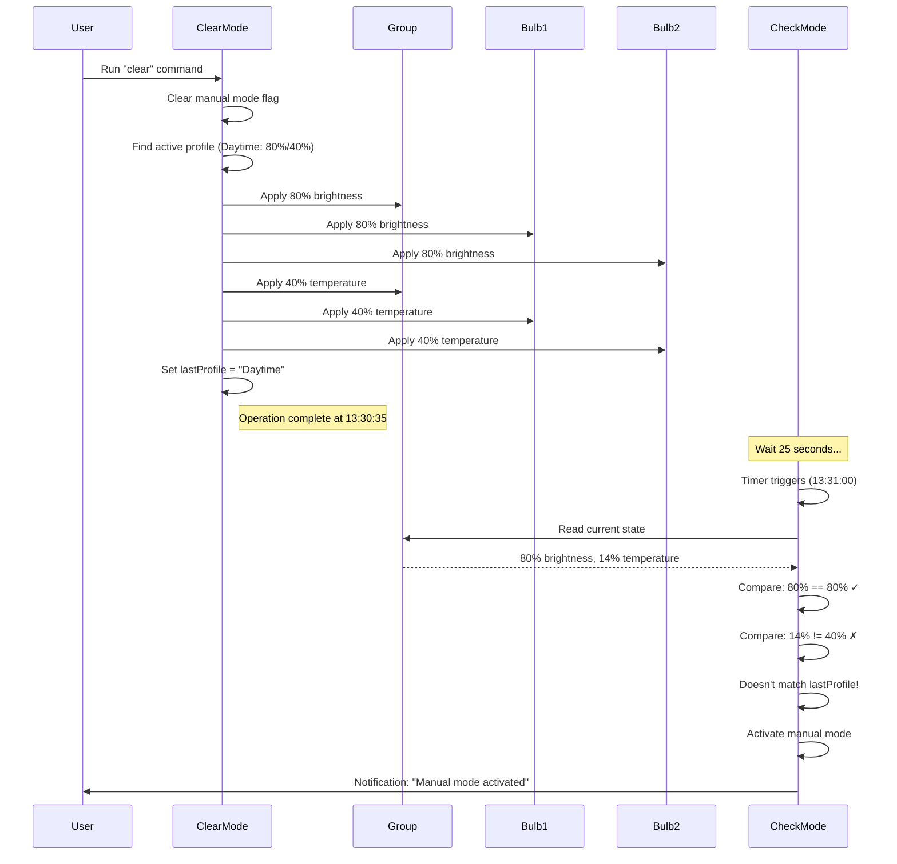

# Manual Mode Reactivation Issue - Root Cause Analysis

## Problem Statement

When resetting a light to auto mode using "clear", manual mode is immediately reactivated within seconds.

**Timeline of Events:**
```
13:30:35 - [Stue Standerlampe] Manual mode cleared → auto
13:31:00 - [Stue Standerlampe] Manual mode activated (80% / 14)
           ↑ Only 25 seconds later!
```

## Root Cause Analysis

### 1. Current Environment
- **Device:** Stue Standerlampe (group with 2 bulbs: 1/2 and 2/2)
- **Check Mode Schedule:** Runs every minute
- **Expected Profile:** Daytime (80% brightness, 40% temperature at 13:30)
- **Actual State After Clear:** 80% brightness, 14% temperature

### 2. Sequence of Events



### 3. The Core Problem

**Temperature Application Failure:**
The temperature did not successfully apply to the group or was not reflected correctly when read back. The group reports 14% instead of the expected 40%.

**Possible Causes:**
1. **Race Condition:** Check mode reads the group state before all bulbs have updated
2. **Partial Failure:** One bulb updated to 40%, the other stayed at 14%, group reports average or wrong value
3. **Silent Failure:** Temperature set command failed but no error was thrown
4. **Group State Lag:** Group's reported temperature hasn't synced with member bulbs yet
5. **No Fade Buffer:** Clear mode uses instant application (duration=0), no fade tracking added

### 4. Why This Is a Problem

**Check Mode Logic (lines 1630-1747):**
```javascript
// Check mode runs every minute
if (CHECK_MANUAL && !FORCE_UPDATE && currentBrightness !== null) {
    // Skip checks...
    
    // Check if values match active profile
    const dimDiff = Math.abs(currentBrightness - activeProfile.brightness);
    const tempDiff = currentTemperature !== null 
      ? Math.abs(currentTemperature - activeProfile.temperature) 
      : 0;
    
    const isCorrect = dimDiff <= SETTINGS.tolerance && tempDiff <= SETTINGS.tolerance;
    
    if (isCorrect) {
        // Already correct - skip
    }
    
    // Check if values match LAST applied profile
    const lastProfileName = getLastProfile(DEVICE_ID);
    const matchesLastProfile = /* compare with last profile */;
    
    if (matchesLastProfile) {
        // Just needs updating to new profile
    } else {
        // ⚠️ VALUES DON'T MATCH LAST PROFILE
        // ➜ ASSUME MANUAL ADJUSTMENT
        setManualMode(DEVICE_ID, true);
        return { skipped: true, reason: 'manual_adjustment_detected' };
    }
}
```

**The Issue:**
- Clear mode sets `lastProfile = "Daytime"` (80%/40%)
- 25 seconds later, check mode reads: 80%/14%
- Temperature doesn't match (14% vs 40%, diff = 26% > 10% tolerance)
- Script concludes: "User manually adjusted the light!"
- Manual mode reactivated

## Proposed Solutions

### Solution 1: Grace Period After Clear/Force Operations ⭐ RECOMMENDED
Add a cooldown period after clear/force operations where check mode doesn't activate manual mode.

**Changes Required:**
- Add global variable to track last clear/force timestamp per device
- Check mode: Skip manual mode detection if within grace period (e.g., 2 minutes)
- Still allow profile updates, just don't activate manual mode

**Pros:**
- Simple and effective
- Addresses root cause directly
- No false positives during legitimate clear operations
- Doesn't affect normal operation

**Cons:**
- If user actually makes manual adjustment right after clear, it won't be detected for 2 minutes

### Solution 2: Add Fade Tracking for Clear Mode
Even though clear mode uses instant application (duration=0), mark the device as "updating" for a buffer period.

**Changes Required:**
- Call `setDeviceFading(deviceId, 10)` in clear mode (10 second buffer)
- Check mode already skips devices that are fading

**Pros:**
- Leverages existing fade tracking system
- Simple implementation

**Cons:**
- 10 seconds might not be enough if there's a longer sync delay
- Doesn't address the underlying temperature application issue

### Solution 3: Verify Group Member States
After applying settings to a group, verify that all member bulbs successfully updated.

**Changes Required:**
- After applying to group, read back all member bulb states
- Retry if any member doesn't match expected values
- Only set lastProfile after verification complete

**Pros:**
- Ensures consistent state across all bulbs
- More robust and reliable

**Cons:**
- More complex implementation
- Slower execution (additional read operations)
- May still have race conditions with verification timing

### Solution 4: Increase Temperature Tolerance
Increase the tolerance for temperature matching from 10% to a higher value.

**Changes Required:**
- Add separate `temperatureTolerance` setting (e.g., 0.20 = 20%)
- Use larger tolerance for temperature comparisons

**Pros:**
- Quick fix
- Simple implementation

**Cons:**
- Doesn't address root cause
- May miss legitimate manual adjustments
- Reduces precision of manual detection

### Solution 5: Read Group State With Delay
After clear mode applies settings, wait a short period before setting lastProfile.

**Changes Required:**
- After `applyLighting()`, add `await wait(2000)` (2 seconds)
- Re-read device state to confirm applied
- Set lastProfile based on confirmed state

**Pros:**
- Ensures state has propagated before recording
- Works around sync delays

**Cons:**
- Slower clear operation (user-visible delay)
- Arbitrary wait time may not always be sufficient

## Recommended Implementation Plan

### Phase 1: Quick Fix (Solution 1 + Solution 2)
Implement grace period AND fade tracking for immediate relief.

**Implementation Steps:**
1. Add `AL_LastClearForce_<deviceKey>` timestamp tracking
2. In clear/force mode: Set timestamp to current time
3. In clear mode: Call `setDeviceFading(DEVICE_ID, 30)` for 30-second buffer
4. In check mode: Skip manual mode activation if within 90 seconds of last clear/force
5. Add detailed logging to track when grace period is active

**Benefits:**
- Combines two complementary approaches
- Immediate relief from false positives
- Low risk, minimal code changes

### Phase 2: Root Cause Investigation
Add diagnostic logging to understand why temperature isn't applying correctly.

**Investigation Steps:**
1. Add detailed logging before/after temperature application
2. Log group state immediately after application
3. Log all member bulb states after application
4. Compare member states with group state
5. Identify which bulb(s) have incorrect temperature

### Phase 3: Robust Solution (Solution 3)
Implement verification and retry logic based on Phase 2 findings.

**Implementation Steps:**
1. Create `verifyGroupState()` function
2. After applying to group, verify all members match expected values
3. Retry failed members up to 3 times
4. Only proceed if all members verified or max retries exceeded
5. Log warnings if verification fails

## Code Changes Preview

### Lines to Modify
- **Lines 1560-1608:** Clear mode logic - add grace period and fade tracking
- **Lines 1630-1747:** Check mode logic - skip manual detection during grace period
- **Lines 844-857:** Add grace period tracking functions
- **Lines 1280-1325:** `applyLighting()` - optionally add verification

### New Global Variables
- `AL_LastClearForce_<deviceKey>` - Timestamp of last clear/force operation

### Configuration Changes
```javascript
const SETTINGS = {
  // ... existing settings ...
  graceperiodAfterClear: 90,  // Seconds to wait before detecting manual mode after clear
  clearFadeBuffer: 30,         // Seconds to mark as "fading" after clear operation
  // ... rest of settings ...
};
```

## Testing Plan

1. **Test clear mode with grace period:**
   - Clear manual mode
   - Wait 30 seconds
   - Verify check mode doesn't reactivate manual mode
   - Wait 90 seconds
   - Verify normal manual detection resumes

2. **Test temperature application:**
   - Enable detailed logging
   - Clear manual mode
   - Check logs for temperature values applied
   - Check logs for temperature values read back
   - Identify discrepancies

3. **Test group member states:**
   - Clear manual mode
   - Read group state
   - Read all member bulb states
   - Compare values
   - Document any inconsistencies

## Risk Assessment

**Low Risk:**
- Grace period implementation (Solution 1)
- Fade tracking for clear mode (Solution 2)

**Medium Risk:**
- Verification logic (Solution 3) - may introduce delays

**High Risk:**
- Changing core tolerance values (Solution 4) - may affect all manual detection

## Recommendation

**Implement Solution 1 + Solution 2 immediately** for quick relief from false positives, then investigate root cause with additional logging to determine if Solution 3 is needed.

This approach:
- ✅ Solves the immediate problem
- ✅ Low risk of introducing new issues
- ✅ Preserves existing functionality
- ✅ Leaves room for more robust solution later
- ✅ Can be implemented quickly
