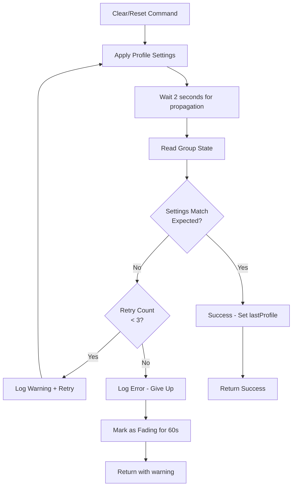

# Verification and Retry Solution for Manual Mode Issue

## Enhanced Solution: Verify-and-Retry Approach

Instead of just working around the timing issue with grace periods, we'll make clear/reset operations **verify** that settings were applied correctly, and **retry** if they weren't.

## Architecture



## Implementation Strategy

### Phase 1: Core Verification Function
Create a new helper function to verify group state matches expected values.

```javascript
/**
 * Verify device state matches expected values
 * For groups, checks the group's reported state
 * @param {object} device - Device object
 * @param {number} expectedBrightness - Expected brightness (0-1)
 * @param {number} expectedTemperature - Expected temperature (0-1)
 * @param {number} tolerance - Tolerance for comparison (default: SETTINGS.tolerance)
 * @returns {object} { success: boolean, brightness: number, temperature: number, errors: [] }
 */
async function verifyDeviceState(device, expectedBrightness, expectedTemperature, tolerance = SETTINGS.tolerance) {
    // Wait briefly for state to propagate
    await new Promise(resolve => setTimeout(resolve, 1500));
    
    // Re-fetch device to get latest state
    const freshDevice = await Homey.devices.getDevice({ id: device.id });
    
    const currentBrightness = freshDevice.capabilitiesObj?.dim?.value ?? null;
    const currentTemperature = freshDevice.capabilitiesObj?.light_temperature?.value ?? null;
    
    const errors = [];
    
    // Check brightness
    const brightnessDiff = currentBrightness !== null 
        ? Math.abs(currentBrightness - expectedBrightness)
        : 0;
    
    const brightnessMatch = currentBrightness !== null && brightnessDiff <= tolerance;
    
    if (!brightnessMatch) {
        errors.push(`Brightness mismatch: expected ${Math.round(expectedBrightness * 100)}%, got ${Math.round(currentBrightness * 100)}%`);
    }
    
    // Check temperature
    const temperatureDiff = currentTemperature !== null 
        ? Math.abs(currentTemperature - expectedTemperature)
        : 0;
    
    const temperatureMatch = currentTemperature !== null && temperatureDiff <= tolerance;
    
    if (!temperatureMatch && currentTemperature !== null) {
        errors.push(`Temperature mismatch: expected ${Math.round(expectedTemperature * 100)}%, got ${Math.round(currentTemperature * 100)}%`);
    }
    
    return {
        success: brightnessMatch && (temperatureMatch || currentTemperature === null),
        brightness: currentBrightness,
        temperature: currentTemperature,
        brightnessDiff,
        temperatureDiff,
        errors
    };
}
```

### Phase 2: Retry Logic for Clear/Reset Operations
Wrap the application logic in a retry loop.

```javascript
/**
 * Apply lighting with verification and retry
 * @param {object} device - Device object
 * @param {number} brightness - Target brightness
 * @param {number} temperature - Target temperature
 * @param {string} profileName - Profile name for logging
 * @param {boolean} useDuration - Whether to use fade duration
 * @returns {object} Result with verification status
 */
async function applyLightingWithRetry(device, brightness, temperature, profileName, useDuration = false) {
    const maxRetries = 3;
    let attempt = 0;
    let lastError = null;
    
    while (attempt < maxRetries) {
        attempt++;
        
        if (attempt > 1 && SETTINGS.enableLogging) {
            log(`[${device.name}] Retry attempt ${attempt}/${maxRetries}`);
        }
        
        // Apply the lighting
        await applyLighting(device, brightness, temperature, useDuration);
        
        // Verify it worked (only for instant applications - skip for fades)
        if (!useDuration) {
            const verification = await verifyDeviceState(device, brightness, temperature);
            
            if (verification.success) {
                if (attempt > 1 && SETTINGS.enableLogging) {
                    log(`[${device.name}] ✓ Verification succeeded on attempt ${attempt}`);
                }
                return {
                    success: true,
                    attempts: attempt,
                    verification
                };
            }
            
            // Verification failed
            lastError = verification.errors.join(', ');
            
            if (SETTINGS.enableLogging) {
                log(`[${device.name}] ✗ Verification failed (attempt ${attempt}): ${lastError}`);
            }
            
            // Wait before retry (longer each time)
            if (attempt < maxRetries) {
                await new Promise(resolve => setTimeout(resolve, 1000 * attempt));
            }
        } else {
            // For fade operations, skip verification and return success
            return {
                success: true,
                attempts: attempt,
                skippedVerification: true
            };
        }
    }
    
    // All retries failed
    if (SETTINGS.enableLogging) {
        log(`[${device.name}] ✗ All ${maxRetries} attempts failed. Last error: ${lastError}`);
    }
    
    return {
        success: false,
        attempts: maxRetries,
        error: lastError
    };
}
```

### Phase 3: Group Member Verification (Optional Enhancement)
For groups, also verify each member bulb individually.

```javascript
/**
 * Verify all group members have correct state
 * @param {string} groupName - Group device name
 * @param {number} expectedBrightness - Expected brightness
 * @param {number} expectedTemperature - Expected temperature
 * @returns {object} Verification result with per-member status
 */
async function verifyGroupMembers(groupName, expectedBrightness, expectedTemperature) {
    const members = await findGroupMembers(groupName);
    
    if (members.length === 0) {
        return { isGroup: false };
    }
    
    const memberResults = [];
    let allMatch = true;
    
    for (const member of members) {
        const verification = await verifyDeviceState(member, expectedBrightness, expectedTemperature);
        memberResults.push({
            name: member.name,
            ...verification
        });
        
        if (!verification.success) {
            allMatch = false;
            if (SETTINGS.enableDetailedLogging) {
                log(`[${member.name}] Mismatch: ${verification.errors.join(', ')}`);
            }
        }
    }
    
    return {
        isGroup: true,
        allMatch,
        members: memberResults,
        failedMembers: memberResults.filter(m => !m.success)
    };
}
```

### Phase 4: Integration with Clear/Reset Mode
Modify the clear and force/reset operations to use verification.

```javascript
// In CLEAR_MANUAL mode (around lines 1560-1608)
if (CLEAR_MANUAL) {
    // ... existing clear logic ...
    
    if (!isOn) {
        // Light is off - just clear manual mode
        return { room: roomName, action: 'manual_mode_cleared', lightOff: true };
    }
    
    // Light is on - apply profile WITH VERIFICATION
    const result = await applyLightingWithRetry(
        device, 
        activeProfile.brightness, 
        activeProfile.temperature, 
        activeProfile.name,
        false  // instant, no fade
    );
    
    if (result.success) {
        // Verification passed - safe to set lastProfile
        setLastProfile(DEVICE_ID, activeProfile.name);
        
        const message = `[${roomName}] ${activeProfile.name} applied and verified`;
        if (SETTINGS.enableLogging) {
            log(message + (result.attempts > 1 ? ` (after ${result.attempts} attempts)` : ''));
        }
        await notify(message);
    } else {
        // Verification failed after retries
        // Mark as fading for extended period to prevent false manual mode detection
        setDeviceFading(DEVICE_ID, 60);
        
        const errorMsg = `[${roomName}] Failed to apply profile: ${result.error}`;
        log(errorMsg);
        await notify(errorMsg);
        
        // Don't set lastProfile - we don't know the actual state
    }
    
    return {
        room: roomName,
        profile: activeProfile.name,
        verified: result.success,
        attempts: result.attempts,
        error: result.error
    };
}
```

## Configuration Settings

Add new settings to control verification behavior:

```javascript
const SETTINGS = {
    // ... existing settings ...
    enableVerification: true,      // Verify settings after clear/reset
    verificationRetries: 3,        // Max retry attempts
    verificationDelay: 1500,       // Wait time before verification (ms)
    verificationTolerance: 0.10,   // Tolerance for verification (10%)
    failedVerificationBuffer: 60   // Fade buffer if verification fails (seconds)
};
```

## Benefits of This Approach

✅ **Reliability** - Ensures settings actually applied before marking as complete
✅ **Self-Healing** - Automatically retries if first attempt fails
✅ **Diagnostic** - Logs exactly which setting failed and why
✅ **Safety** - If verification fails, extends fade buffer to prevent false manual mode
✅ **Transparency** - User gets notification if there's a persistent problem
✅ **Optional** - Can be disabled via configuration if it causes issues

## Edge Cases Handled

1. **Network delays** - Waits 1.5s before verification, increases wait between retries
2. **Partial failures** - Logs exactly which setting (brightness/temperature) failed
3. **Group sync issues** - Optional member verification identifies problematic bulbs
4. **Persistent failures** - After 3 retries, marks device as fading for 60s to prevent false manual mode
5. **No temperature support** - Verification ignores temperature for devices without capability

## Performance Impact

**Clear/Reset Operation Timing:**
- Without verification: ~100ms
- With verification (success): ~1.7s (1.5s wait + 0.2s verification)
- With verification (1 retry): ~3.7s (first attempt + 1s delay + retry)
- With verification (3 retries): ~9.7s (worst case)

**Tradeoff:** Slower clear/reset operations in exchange for guaranteed correct state and no false manual mode activations.

## Fallback Strategy

If verification fails after all retries:
1. Log detailed error message
2. Send notification to user
3. Mark device as fading for 60 seconds
4. Don't set lastProfile (prevents false manual mode detection)
5. Return error status for flow logic

## Testing Scenarios

### Test 1: Normal Case (All Works)
1. Run clear command
2. Verify settings applied correctly
3. Confirm lastProfile set
4. Confirm no retry needed

### Test 2: First Attempt Fails
1. Run clear command (with one bulb slow to respond)
2. First verification fails
3. Retry automatically triggered
4. Second verification succeeds
5. Confirm lastProfile set with retry count logged

### Test 3: All Retries Fail
1. Run clear command (with persistent issue)
2. All 3 retries fail
3. Error notification sent
4. Device marked as fading for 60s
5. Confirm check mode doesn't activate manual mode during buffer
6. After 60s, normal operation resumes

### Test 4: Group Member Verification
1. Run clear on group
2. Verify group reports correct state
3. Verify all member bulbs report correct state
4. Identify any members with mismatched state
5. Log discrepancies

## Migration Path

**Phase 1:** Basic verification (this solution)
- Add verification functions
- Update clear/reset to use verification
- Test with single devices

**Phase 2:** Enhanced diagnostics
- Add group member verification
- Add detailed logging per bulb
- Identify problematic hardware

**Phase 3:** Proactive monitoring
- Log verification failures to global tracking
- Identify devices with repeated failures
- Send weekly summary of problematic devices

## Code Changes Summary

**New Functions:**
- `verifyDeviceState()` - Core verification logic
- `applyLightingWithRetry()` - Retry wrapper
- `verifyGroupMembers()` - Group-specific verification (optional)

**Modified Sections:**
- Clear mode (lines 1560-1608) - Use retry logic
- Force/Reset mode (lines 1750-1793) - Use retry logic
- Settings configuration (lines 526-537) - Add verification settings

**New Global Variables:**
- None required (uses existing patterns)

## Risk Assessment

**Low Risk:**
- Verification doesn't change existing behavior when verification is disabled
- Only affects clear/reset operations, not normal or check mode

**Medium Risk:**
- Slower clear/reset operations (user-visible delay)
- More complex code path for clear/reset

**Mitigation:**
- Make verification optional via configuration
- Provide clear feedback during retries
- Set reasonable timeout limits
